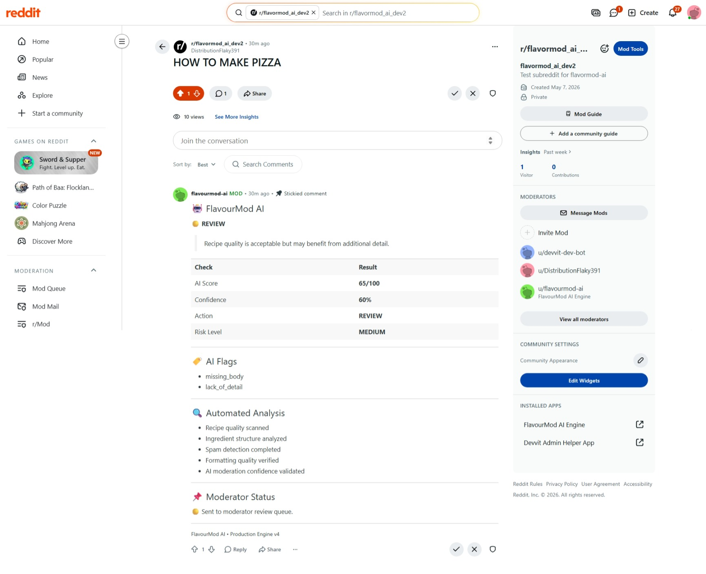
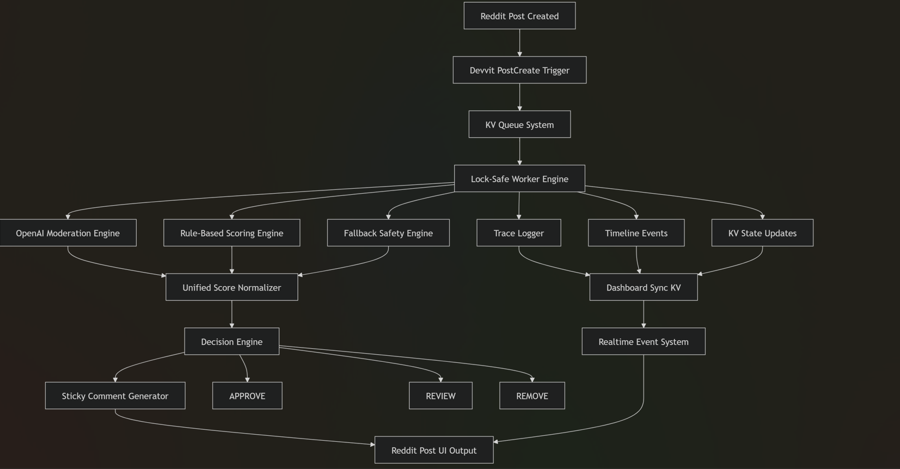
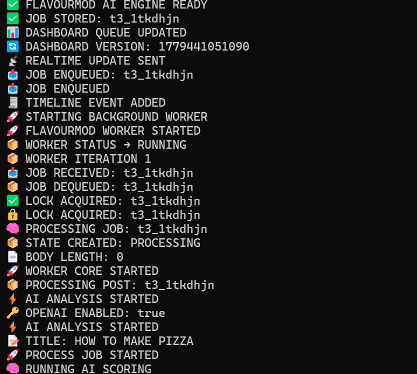
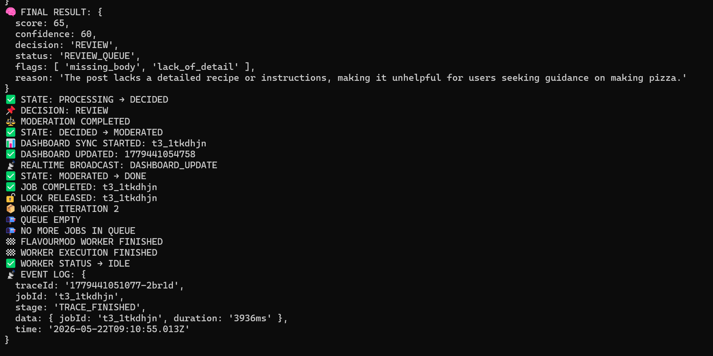

````md
# 🔥 FlavourMod AI ENGINE — Real-Time Reddit Moderation Engine

<p align="center">
  
  
  
  
  
</p>

<p align="center">
  <b>Real-time AI moderation infrastructure that replaces external dashboards with live sticky comments directly inside Reddit posts.</b>
</p>

---

# 🚀 Live Concept

<p align="center">
  
</p>

<p align="center">
  Every Reddit post becomes its own <b>self-updating AI moderation dashboard</b>.
</p>

---

# 🧠 Core Innovation

<p align="center">
  
</p>

Unlike traditional moderation systems that rely on separate admin dashboards, FlavourMod renders moderation intelligence directly inside Reddit posts through synchronized sticky comments.

This creates:

* ✅ Native Reddit moderation UX
* ✅ Transparent AI reasoning
* ✅ Real-time moderation visibility
* ✅ Fully in-platform moderation workflows
* ✅ Explainable AI moderation decisions

---

# ⚡ Why FlavourMod?

Traditional moderation systems rely on:

* ❌ External moderation dashboards
* ❌ Delayed moderation visibility
* ❌ Hidden AI decision logic
* ❌ Fragmented moderation workflows
* ❌ Separate moderator tooling

FlavourMod introduces a different architecture:

* ✅ Real-time AI moderation
* ✅ Sticky-comment-first moderation UX
* ✅ Native Reddit integration
* ✅ Transparent moderation decisions
* ✅ Event-driven moderation pipeline
* ✅ Live moderation directly inside posts

---

# 🎬 Demo Video

<p align="center">
  <a href="https://www.loom.com/share/89d9b75e7bb945818836aef1d2fb8eeb">
    
  </a>
</p>

## Demo Includes

* Reddit post creation
* PostCreate trigger activation
* KV queue processing
* Worker execution pipeline
* OpenAI moderation response
* Decision engine transitions
* Sticky comment generation
* Real-time moderation updates

---

# 🏗️ System Architecture

```mermaid
graph TD;

A[Reddit Post Created] --> B[Devvit PostCreate Trigger]
B --> C[KV Queue Storage]
C --> D[Worker Engine]

D --> E[OpenAI Moderation]
D --> F[Rule Engine]
D --> G[Fallback Engine]

E --> H[Decision Engine]
F --> H
G --> H

H --> I[State Machine]
I --> J[Sticky Comment Dashboard]
J --> K[Realtime KV Sync]
K --> L[Live Reddit Post UI]
````

---

# ⚡ Real-Time Event Pipeline

```text
PostCreate Event
      ↓
KV Queue Storage
      ↓
Lock-Safe Worker Engine
      ↓
AI Scoring Layer
   ├── OpenAI Moderation
   ├── Rule Engine
   ├── Fallback Engine
      ↓
Decision Engine
      ↓
Sticky Comment Renderer
      ↓
Realtime Dashboard Sync
```

---

# 📸 Screenshots

---

## 🏗️ Architecture Diagram

<p align="center">
  
</p>

---

## 💬 Sticky Comment Dashboard

<p align="center">
  
</p>

<p align="center">
  Real-time moderation decisions rendered directly inside Reddit posts.
</p>

---

## ⚡ Worker Pipeline Logs

<p align="center">
  
</p>

<p align="center">
  Queue lifecycle, AI execution flow, and moderation state transitions.
</p>

---

## 🔄 Moderation State Machine

<p align="center">
  
</p>

<p align="center">
  Production-style moderation lifecycle tracking system.
</p>

---

## 🧠 AI Moderation Report

<p align="center">
  
</p>

<p align="center">
  Structured AI moderation reasoning with confidence and decision outputs.
</p>

---

# ⚡ Key Features

---

## 🧠 Hybrid AI Moderation Engine

FlavourMod uses a multi-layer moderation architecture:

* 🧠 OpenAI moderation layer
* ⚙️ Rule-based scoring engine
* 🛡️ Safety floor protection system
* 🔁 Fallback moderation engine
* 📊 Confidence-based moderation routing

### AI Output Includes

* Score (0–100)
* Confidence score
* Moderation reasoning
* Structured moderation flags
* Final moderation decision
* Traceable moderation lifecycle

---

## 🔄 Event-Driven Worker Infrastructure

### Features

* Lock-safe worker execution
* Multi-job queue processing
* Realtime event broadcasting
* State-machine moderation flow
* Full trace logging
* Fault-tolerant processing pipeline
* Queue synchronization system

---

## 💬 Sticky Comment Dashboard

Each Reddit post becomes a live moderation dashboard.

### Displays

* AI moderation score
* Moderation decision
* Confidence score
* Moderation flags
* AI-generated reasoning
* Live synchronization state

### Why This Matters

* No external dashboard required
* Moderation becomes transparent
* Native Reddit moderation experience
* Live moderation visibility inside posts

---

# 🧠 Moderation Intelligence

---

## 🍲 Recipe Detection

FlavourMod is optimized for structured recipe communities:

* Ingredients parsing
* Cooking-step recognition
* Recipe structure detection
* Food-context classification
* Instruction-aware moderation

---

## ❓ Question Detection

Detects instructional and educational intent:

* “how”
* “what”
* “why”
* tutorial-style content
* learning-oriented posts

Helps reduce false removals.

---

## 🚨 Spam Detection

Detects:

* promotional patterns
* suspicious links
* low-quality submissions
* spam behavior signals
* repetitive posting patterns

---

# 📊 Moderation Logic

| Score Range | Decision | Meaning                       |
| ----------- | -------- | ----------------------------- |
| 80–100      | APPROVE  | High-quality safe content     |
| 40–79       | REVIEW   | Requires moderator inspection |
| 0–39        | REMOVE   | Unsafe or spam-like content   |

---

# 💬 Example Sticky Comment

```text
🧠 FlavourMod AI Moderation

Score: 65/100
Decision: REVIEW

Flags:
- missing_body

Reason:
The post lacks structured content for classification.

Confidence: 70%
```

---

# 📡 Real-Time Infrastructure

FlavourMod includes:

* KV-backed moderation queue
* Version-based synchronization
* Live realtime broadcasts
* Sticky comment updates
* Queue observability
* Worker state tracking
* Event-driven synchronization

---

## Moderation State Machine

```text
QUEUED
   ↓
PROCESSING
   ↓
DECIDED
   ↓
MODERATED
   ↓
DONE
```

---

# 🔒 Reliability Features

* Lock-safe worker execution
* Idempotent processing model
* Fault-tolerant fallback system
* Queue recovery support
* Score normalization layer
* AI safety protections
* Realtime synchronization safeguards

---

# ⚙️ Core Components

---

## 1. Devvit Trigger Layer

* Captures `PostCreate` events
* Initializes moderation jobs
* Starts worker execution pipeline
* Handles realtime synchronization

---

## 2. KV Queue System

* Persistent moderation queue
* Stores moderation jobs
* Maintains synchronization state
* Realtime dashboard versioning
* Queue lifecycle tracking

---

## 3. Worker Engine

* Async moderation processor
* Lock-safe execution
* AI orchestration layer
* State transition manager
* Realtime event emitter

---

## 4. AI Moderation Layer

* OpenAI moderation scoring
* Rule-engine classification
* Recipe/question/spam detection
* Confidence normalization
* Safety override system

---

## 5. Sticky Comment Dashboard

* Native Reddit moderation interface
* Live moderation visibility
* Realtime synchronization
* Transparent AI reasoning
* Embedded moderation reporting

---

# 🛠️ Tech Stack

<p align="center">


</p>

---

# 📦 Setup

```bash
npm install
npm run build
npx devvit upload
npx devvit install
```

---

# 🔐 Environment Variables

| Variable       | Purpose                  |
| -------------- | ------------------------ |
| OPENAI_API_KEY | OpenAI moderation access |

---

# 🎯 Use Cases

* Reddit recipe moderation
* AI-assisted moderation workflows
* Spam filtering systems
* Low-quality content detection
* Realtime moderation infrastructure
* Event-driven moderation pipelines
* Transparent moderation systems

---

# 🏆 Why This Project Stands Out

FlavourMod combines:

* 🧠 AI reasoning
* ⚡ Realtime event systems
* 🔄 Worker-based infrastructure
* 💬 Native Reddit moderation UX
* 📡 Transparent moderation visibility
* 🏗️ Production-style architecture
* 🔍 Explainable AI moderation

Most moderation systems rely on external dashboards.

FlavourMod brings moderation directly into Reddit itself.

---

# 🔮 Future Improvements

* Moderator action buttons
* Embedded approval controls
* Multi-subreddit scaling
* Historical analytics engine
* AI learning feedback loops
* Advanced moderation metrics
* Moderator review interface

---

# 🔐 Safety & Transparency

FlavourMod is designed as a human-aligned moderation system:

* AI assists moderators
* Decisions are explainable
* Every action is traceable
* Logs are audit-friendly
* Human moderators retain final authority
* Moderation visibility remains transparent

---

# ⚠️ Current Limitations

* Sticky-comment-based UI only
* Optimized primarily for structured content
* OpenAI API key required
* Minor KV synchronization delay possible under load
* Moderation tuning currently recipe-focused

---

# 🏁 Final Statement

<p align="center">
<b>
FlavourMod transforms Reddit moderation into a real-time, AI-powered, transparent system directly inside every post.
</b>
</p>

<p align="center">
  
</p>

---

# 👨‍💻 Author

Built for the Reddit Devvit ecosystem
Focused on scalable AI moderation systems, realtime infrastructure, and event-driven architecture.

---

```
```
