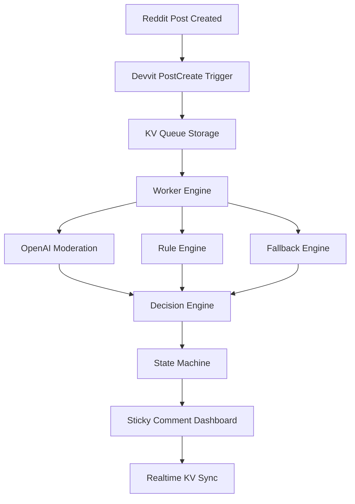
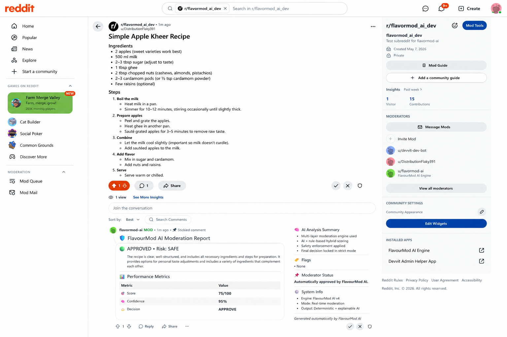
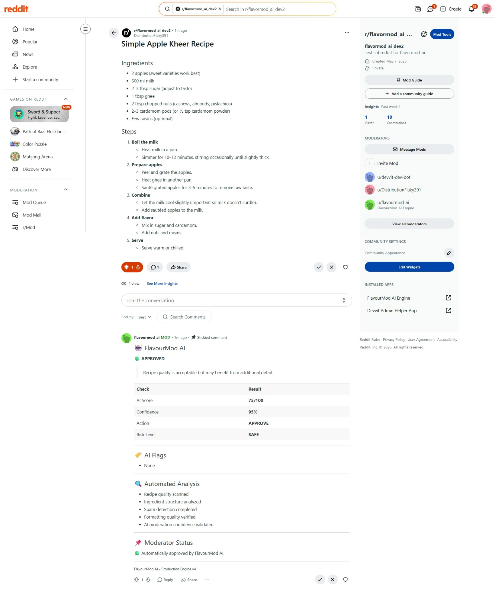
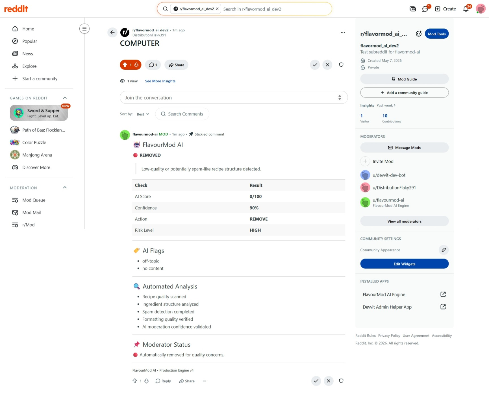

# 🔥 FlavourMod AI — Real-Time Reddit Moderation Engine

<p align="center">
  
  
  
  
  
</p>

<p align="center">
  <b>
    Real-time AI moderation system that replaces external dashboards with live sticky comments directly inside Reddit posts.
  </b>
</p>

---

# 🚀 Live Concept

<p align="center">
  
</p>

<p align="center">
  <b>
    Every Reddit post becomes its own self-updating AI moderation dashboard.
  </b>
</p>

---

# ⚡ Why FlavourMod?

Traditional moderation systems rely on:

* ❌ External moderation dashboards
* ❌ Delayed moderation visibility
* ❌ Hidden AI decision logic
* ❌ Separate moderator tooling
* ❌ Low transparency for communities

FlavourMod introduces a different approach:

* ✅ Native Reddit moderation experience
* ✅ Real-time AI moderation visibility
* ✅ Transparent moderation reasoning
* ✅ Sticky-comment-first architecture
* ✅ Fully event-driven moderation pipeline
* ✅ Production-style worker infrastructure

---

# 🧠 Core Innovation

<p align="center">
  
</p>

Instead of building an external dashboard UI, FlavourMod transforms every Reddit post into a live moderation interface.

Moderation decisions are rendered directly inside Reddit using sticky comments synchronized with the moderation pipeline in real time.

---

# ⚡ Key Features

---

## 🧠 Hybrid AI Moderation Engine

FlavourMod uses a multi-layer moderation pipeline:

* 🧠 OpenAI moderation layer
* ⚙️ Rule-based scoring engine
* 🛡️ Safety floor protection system
* 🔁 Fallback moderation engine

### AI Output Includes

* Score (0–100)
* Confidence score
* Moderation reasoning
* Structured moderation flags
* Final moderation decision

---

## 🔄 Real-Time Event-Driven Pipeline

```text
PostCreate Event
      ↓
KV Queue Storage
      ↓
Lock-Safe Worker Engine
      ↓
AI Scoring Layer
   ├── OpenAI Moderation
   ├── Rule Engine
   ├── Fallback Engine
      ↓
Decision Engine
      ↓
Sticky Comment Renderer
```

### Infrastructure Features

* Lock-safe worker execution
* Multi-job queue processing
* State-machine-based moderation flow
* Real-time event broadcasting
* Full trace logging and observability
* Fault-tolerant moderation handling

---

## 💬 Sticky Comment Dashboard

Every moderated Reddit post receives a live sticky comment containing:

* 🧠 AI score
* ⚖️ Moderation decision
* 🚩 Flags and detected issues
* 💬 AI reasoning
* 📊 Confidence score

### Why this matters

* No external dashboard required
* Fully native Reddit experience
* Transparent moderation visibility
* Live synchronization with worker state
* Community-visible moderation transparency

---

## 📡 Real-Time Infrastructure

FlavourMod includes:

* KV-backed moderation queue
* Version-based synchronization
* Realtime worker broadcasts
* Sticky comment live updates
* Queue observability
* Worker trace tracking

### Moderation State Machine

```text
QUEUED
   ↓
PROCESSING
   ↓
DECIDED
   ↓
MODERATED
   ↓
DONE
```

---

# 🏗️ Architecture



---

# 📸 Screenshots

---

## 🏗️ Architecture Diagram

<p align="center">
  
</p>

---

## 💬 Sticky Comment Dashboard Updated

<p align="center">
  
</p>

---

## 💬 Sticky Comment Dashboard

<p align="center">
  
</p>

---

## ⚡ Worker Pipeline Logs

<p align="center">
  
</p>

---

## 🔄 State Machine Flow

<p align="center">
  
</p>

---

## 🧠 AI Moderation Report

<p align="center">
  
</p>

---

## 🚨 Spam / Removal Detection

<p align="center">
  
</p>

---

# 🧠 Moderation Intelligence

---

## 🍲 Recipe Detection

FlavourMod is optimized for structured recipe communities:

* Ingredients parsing
* Cooking-step recognition
* Structured recipe detection
* Food-context classification

---

## ❓ Question Detection

Detects instructional and informational content such as:

* “how”
* “what”
* “why”
* tutorial-style posts

Used to reduce false moderation actions.

---

## 🚨 Spam Detection

Detects:

* Promotional patterns
* Suspicious links
* Low-quality content
* Spam-like posting behavior

---

# 📊 Moderation Logic

| Score Range | Decision | Meaning |
|---|---|---|
| 80–100 | APPROVE | High-quality safe content |
| 40–79 | REVIEW | Requires moderator inspection |
| 0–39 | REMOVE | Unsafe or spam-like content |

---

## Every moderation result includes:

* AI reasoning
* Confidence score
* Moderation flags
* Structured decision state

---

# 💬 Example Sticky Comment

```text
🧠 FlavourMod AI Moderation

Score: 65/100
Decision: REVIEW

Flags:
- missing_body

Reason:
The post lacks structured content for classification.

Confidence: 70%
```

---

# ⚙️ Core Components

---

## 1. Devvit Trigger Layer

* Captures `PostCreate` events
* Initializes moderation jobs
* Starts worker execution pipeline

---

## 2. KV Queue System

* Persistent moderation queue
* Stores moderation jobs
* Maintains synchronization state
* Realtime dashboard versioning

---

## 3. Worker Engine

* Async moderation processor
* Lock-safe execution
* AI orchestration layer
* State transition manager

---

## 4. AI Moderation Layer

* OpenAI moderation scoring
* Rule-engine classification
* Recipe/question/spam detection
* Safety override system

---

## 5. Sticky Comment Dashboard

* Native Reddit moderation interface
* Live moderation visibility
* Realtime synchronization
* Transparent AI reasoning output

---

# 🎬 Demo Video

<p align="center">
  <a href="https://vimeo.com/1195668413?share=copy&fl=sv&fe=ci">
    
  </a>
</p>

### Demo showcases:

* Post creation trigger
* Queue + worker pipeline
* OpenAI moderation output
* Decision engine processing
* Sticky comment rendering
* Realtime moderation updates

---

# 🛠️ Tech Stack

<p align="center">


</p>

---

# 📦 Setup

```bash
npm install
npm run build
npx devvit upload
npx devvit install
```

---

# 🔐 Environment Variables

| Variable | Purpose |
|---|---|
| OPENAI_API_KEY | OpenAI moderation engine access |

---

# 🎯 Use Cases

* Reddit recipe moderation
* AI-assisted moderator workflows
* Spam filtering
* Low-quality content detection
* Realtime moderation infrastructure
* Event-driven moderation systems

---

# 🔒 Reliability Features

* Lock-safe worker execution
* Idempotent job processing
* Fault-tolerant moderation fallback
* Score normalization layer
* Queue recovery support
* AI safety floor protections

---

# 🏆 Why This Project Stands Out

FlavourMod combines:

* 🧠 AI reasoning
* ⚡ Realtime event systems
* 🔄 Worker-based infrastructure
* 💬 Native Reddit moderation UX
* 📡 Transparent moderation visibility
* 🏗️ Production-style architecture

Most moderation tools rely on external dashboards.

FlavourMod brings moderation directly into Reddit itself.

---

# 🔐 Safety & Transparency

FlavourMod is designed as a human-aligned moderation system:

* AI assists moderators
* Decisions are explainable
* Every action is traceable
* Logs are audit-friendly
* Human moderators retain final authority

---

# ⚠️ Current Limitations

* Sticky-comment-based UI only
* Optimized primarily for structured content
* OpenAI API key required
* Minor KV synchronization delay possible under load

---

# 🔮 Future Improvements

* Moderator action buttons
* Embedded approval controls
* Multi-subreddit scaling
* Historical analytics engine
* AI learning feedback loops
* Advanced moderation metrics

---

# 🏁 Final Statement

<p align="center">
<b>
FlavourMod transforms Reddit moderation into a real-time, AI-powered, transparent system directly inside every post.
</b>
</p>

<p align="center">
  
</p>

---

# 👨‍💻 Author

Built for the Reddit Devvit ecosystem  
Focused on scalable AI moderation systems, realtime infrastructure, and event-driven architecture.

---
